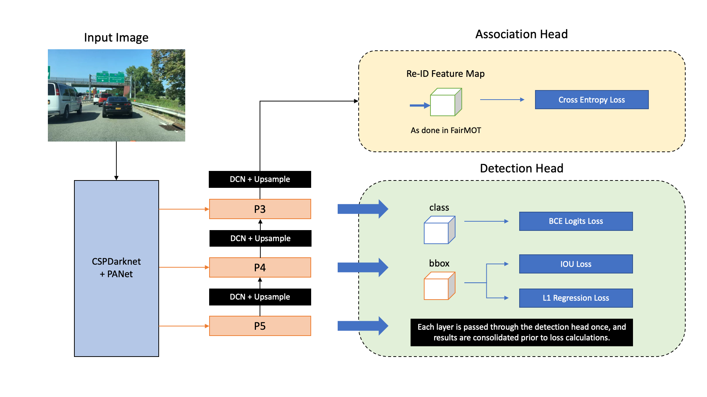

# FairMOT-X

FairMOT-X is a multi-class multi object tracker based on [FairMOT](https://github.com/ifzhang/FairMOT), which has been tailored for training on the BDD100K MOT Dataset. It makes use of [YOLOX](https://github.com/Megvii-BaseDetection/YOLOX) as the detector from end-to-end, and uses deformable convolutions (DCN) to perform feature fusion of PAFPN outputs for reID embedding learning.

<br>

<p align="center">
    
    <em> </br> Overview of FairMOT-X Structure</em>
</p>

## Main Contributions

* Modify [yolo_head.py](./src/lib/models/networks/yolo_head.py) for reID branch and reID embedding learning as done in FairMOT
* Prepare dataset in [yolomot.py](./src/lib/datasets/yolomot.py) for MOT training, including mosaic implementation
* Finetune training and tracking sequences in [yolotrainer.py](./src/lib/trains/yolotrainer.py) and [YoloTracker.py](./src/lib/tracker/YoloTracker.py)
* Minor code adjustments for visualisation and writing results to JSON for BDD100K MOT


## Tracking Performance

### Results on BDD100K Dataset

The following results were recorded after 20 epochs of training. Mosaic augmentation is disabled and L1 detection loss is enabled from epoch 15. FPS is calculated from the average of 200 validation sequences in BDD100K MOT on a single V100 32GB GPU. No pretrained model is used.

| Variant | FPS | mMOTA | mMOTP | mIDF1 |
| - | - | - | - | - |
| YOLOX-S (reID dim 128) | 36.1 | 16.7 | 67.1 | 25.6 |
| YOLOX-M (reID dim 128) | 32.7 | 18.4 | 68.0 | 27.5 |
| YOLOX-L (reID dim 64) | 32.7 | 19.6 | 67.5 | 29.2 |
| YOLOX-L (reID dim 128) | 26.2 | 19.2 | 67.1 | 28.7 |
| YOLOX-L (reID dim 256) | 25.2 | 17.6 | 67.3 | 26.9 |
| YOLOX-X (reID dim 128) | 20.9 | 10.4 | 64.7 | 16.4 |


### Video Demos from BDD100K MOT

<br>

<p align="center">
    
</p>

<p align="center">
    
</p>

## Installation

Please refer to the [FairMOT installation instructions](https://github.com/ifzhang/FairMOT#Installation) to install the required dependencies.

## Train & Demo

The following command runs training with YOLOX-M as the detector. The corresponding network depth and width must be specified, or the default (YOLOX-L) will be used.

```
python3 ./src/train.py mot \
    --exp_id yolo-m --yolo_depth 0.67 --yolo_width 0.75 \
    --lr 7e-4 --lr_step 2 \
    --reid_dim 128 --augment --mosaic \
    --batch_size 16 --gpus 0 
```

To run the demo after training, you can refer to the following example:

```
python3 -W ignore ./src/demo.py mot \
    --load_model path_to_model.pth \
    --input_video path_to_video_or_folder_of_images \
    --reid_dim 128 --yolo_depth 0.67 --yolo_width 0.75
```

## Acknowledgement

This project heavily uses code from [YOLOX](https://github.com/Megvii-BaseDetection/YOLOX), the original [FairMOT](https://github.com/ifzhang/FairMOT), as well as [MCMOT](https://github.com/CaptainEven/MCMOT) and [YOLOv4 MCMOT](https://github.com/CaptainEven/YOLOV4_MCMOT).
